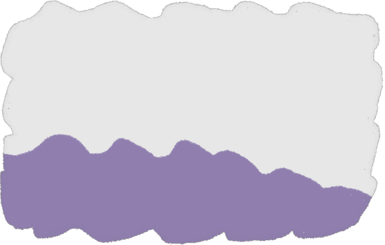
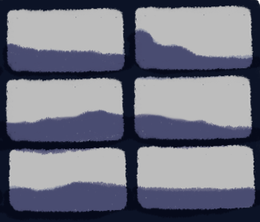

## resumo

jogo plataforma 2d focado em boss fight

# controles

## modo plataforma

wasd - movimento

espaço - pulo / glide

m - dash

seta pra cima - aumenta tamanho da tile em 5 pixeis
seta pra baixo - diminui tamanho da tile em 5 pixeis (obs: da um pulinho antes de fazer isso pra nao entrar pra dentro da terra)
(o valor final fica no arquivo tile_size.txt depois de salvar as alteraçoes com a tecla ctrl esquerda)

left control - salva o tamanho das tiles e o mapa feito no editor de mapas , e sai do jogo
esc - sai do jogo sem salvar alterações

left shift - entra no modo editor

## modo editor

botao esquerdo do mouse - seleciona tile (pode ser segurado para usar como pincel)

tiles:
z - fluf tile

x - topo fluf tile

c - tile cor solida

v - nuvem

b - tijolinho

. - tile em branca (use para tirar tiles)

PARA SAIR DO MODO EDITOR APERTE UMA DAS TECLAS DE TILE

wasd - move a camera

seta pra cima - aumenta o zoom

seta pra baixo - diminui diminui o zoom

## tecnicalidades

feita em uma engine própria construida emcima da biblioteca grafica SDL2

escrito em c++

programado usando Visual studio

## creditos

Designer e programador : Ruan Lourenço ruanlourencosilva.rj@gmail.com

Lead designer e arte designer : Fellype Mendes @flupmendes
